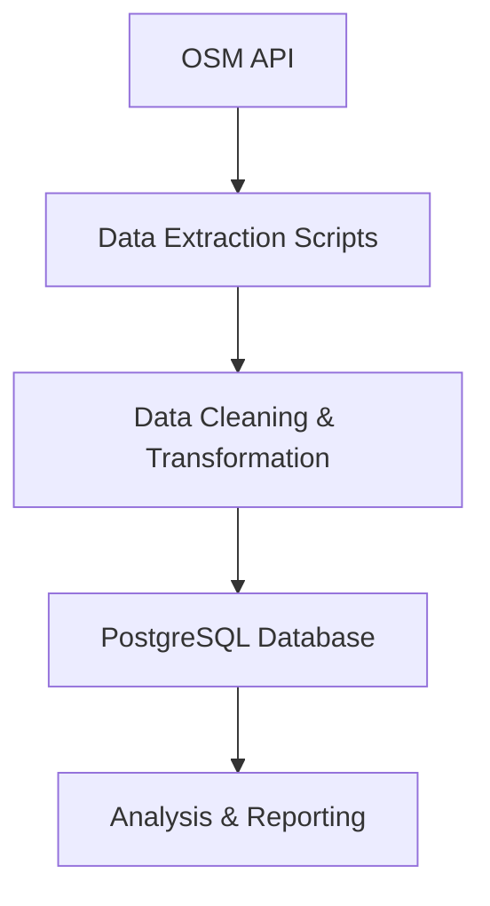

# 🗺️ OSM Data Extraction & ETL Pipeline  
### Internship Project — Webeet.io (2 Months)

---

## 🎯 Project Objective
Extract and process **cultural points of interest** from **OpenStreetMap (OSM)** for the city of **Berlin**, transforming raw geospatial data into a structured format ready for **database integration and analysis**.

---

## 🛠️ Tools & Technologies

### 💻 Languages & Libraries
- Python  
- pandas  
- geopandas  
- osmnx  

### 🗄️ Databases
- PostgreSQL  

### 📊 Development Environment
- Jupyter Notebook (data exploration, analysis, and prototyping)

---

## 🔄 ETL Pipeline Overview

### 📥 Data Extraction
- Pulled geospatial data from the **OSM API** for:
  - 🖼️ Galleries  
  - 🏛️ Museums  
  - 🎨 Public Artworks  
  - 🏢 Exhibition Centers  

### 🧹 Data Cleaning & Transformation
- Normalized raw OSM data for consistency and reliability  
- Filtered and standardized attributes to align with **database schema requirements**  
- Handled missing values, geometry validation, and category mapping  

### 📤 Data Loading
- Loaded processed datasets into a **PostgreSQL** database  
- Created reusable scripts for automated data ingestion  

---

## 📦 Deliverables
- Python scripts for OSM data extraction  
- Data cleaning and transformation pipeline  
- PostgreSQL loading utilities  
- Structured, analysis-ready datasets  

---

## 🖼️ Workflow Diagram

## 🚀 Highlights

- Automated ETL pipeline for geospatial data

- Scalable scripts for repeated use across different OSM categories

- Ensured clean, consistent, and analysis-ready datasets for downstream applications

